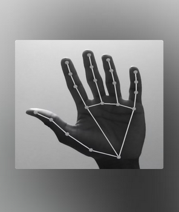

# 🖐️ HandTrack Python

> Control your computer with your hands. No mouse. No keyboard. Pure gesture control.

[](https://www.python.org/downloads/)
[](https://opencv.org/)
[](https://opensource.org/licenses/MIT)

---

## 📸 Demo

<div align="center">
  
  <p><i>Real-time hand landmark detection and gesture recognition</i></p>
</div>

---

## ✨ Features

- **🎯 Cursor Control** - Move your mouse pointer with your index finger
- **🖱️ Click & Drag** - Pinch your index and thumb together to click or drag
- **⚡ Double Click** - Quick successive pinches for double-click actions  
- **📜 Scroll** - Make a fist and move up/down to scroll smoothly
- **⌨️ Hotkey Support** - Bring finger and middle finger together to trigger Win+H
- **🚀 Optimized Performance** - Smooth cursor movement with intelligent acceleration
- **📹 Real-time Tracking** - AI-powered hand detection using MediaPipe

---

## 🎮 Gesture Controls

| Gesture | Action |
|---------|--------|
| Index Finger Position | Move cursor |
| Pinch (Index + Thumb) | Left click |
| Double Pinch | Double click |
| Fist + Move Up/Down | Scroll |
| Middle Finger Down | Windows Hide (Win+H) |

---

## 📋 Requirements

- Python 3.9 or higher
- Webcam
- Windows OS (for pyautogui hotkey features)

---

## 🚀 Installation

1. **Clone or download the repository:**
```bash
cd handtrack-python
```

2. **Install dependencies:**
```bash
pip install -r requirements.txt
```

3. **Run the application:**
```bash
python main.py
```

---

## 📦 Dependencies

- **OpenCV** (`cv2`) - Real-time video processing
- **MediaPipe** (`mediapipe`) - Hand landmark detection
- **PyAutoGUI** (`pyautogui`) - Mouse and keyboard automation
- **CTYpes** - Windows API integration for screen metrics

See `requirements.txt` for full dependencies.

---

## ⚙️ Configuration

The following parameters can be adjusted in `main.py`:

```python
# Hand detection confidence (0.0 - 1.0)
min_detection_confidence=0.7
min_tracking_confidence=0.7

# Cursor smoothing (higher = smoother but more lag)
smooth_factor = 0.15

# Click/gesture detection distances (pixels)
distance_index < 40  # Click threshold
distance_middle < 40  # Hotkey threshold

# Scroll cooldown (seconds)
scroll_cooldown = 0.15
```

---

## 🎬 How It Works

1. **Capture** - Webcam feeds into the application
2. **Detect** - MediaPipe AI model identifies hand landmarks in real-time
3. **Process** - Distance calculations between finger positions determine gestures
4. **Execute** - Corresponding mouse/keyboard actions are triggered
5. **Display** - Visual feedback with hand skeleton overlay

---

## 💡 Tips & Tricks

- **Better tracking**: Ensure good lighting and a clear background
- **Smoother movement**: Adjust `smooth_factor` for your preferred cursor speed
- **Sensitivity tuning**: Modify distance thresholds for different hand sizes
- **Failsafe**: Press `ESC` or move to screen corners if stuck

---

## 📄 License

This project is licensed under the MIT License - see the LICENSE file for details.

---

## 🤝 Contributing

Feel free to submit issues and pull requests to improve the project!

---

## 🔮 Future Enhancements

- [ ] Multi-hand gesture support
- [ ] Gesture customization UI
- [ ] Hand pose classification
- [ ] Cross-platform support (macOS, Linux)
- [ ] Virtual keyboard overlay
- [ ] Gesture recording and playback

---

**Made with ❤️ using Python, OpenCV, and MediaPipe**